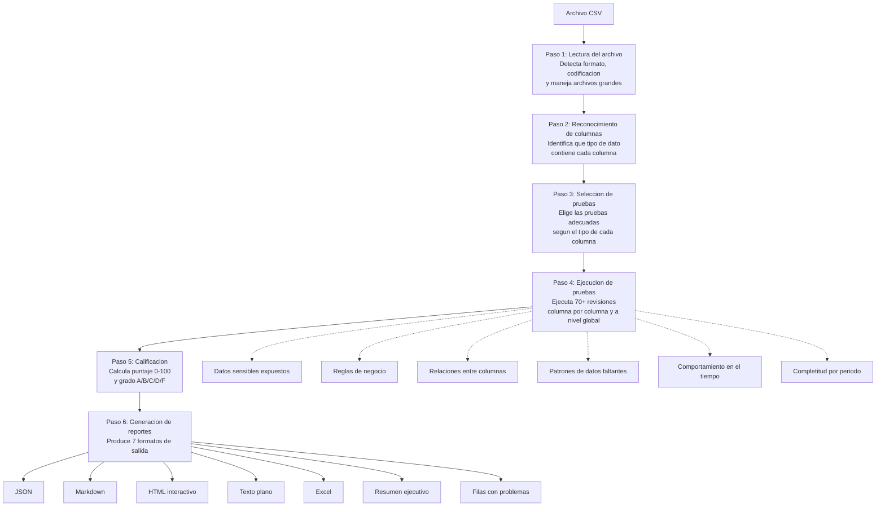
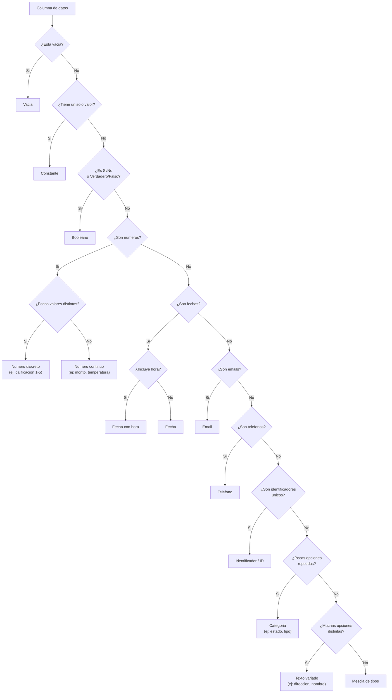
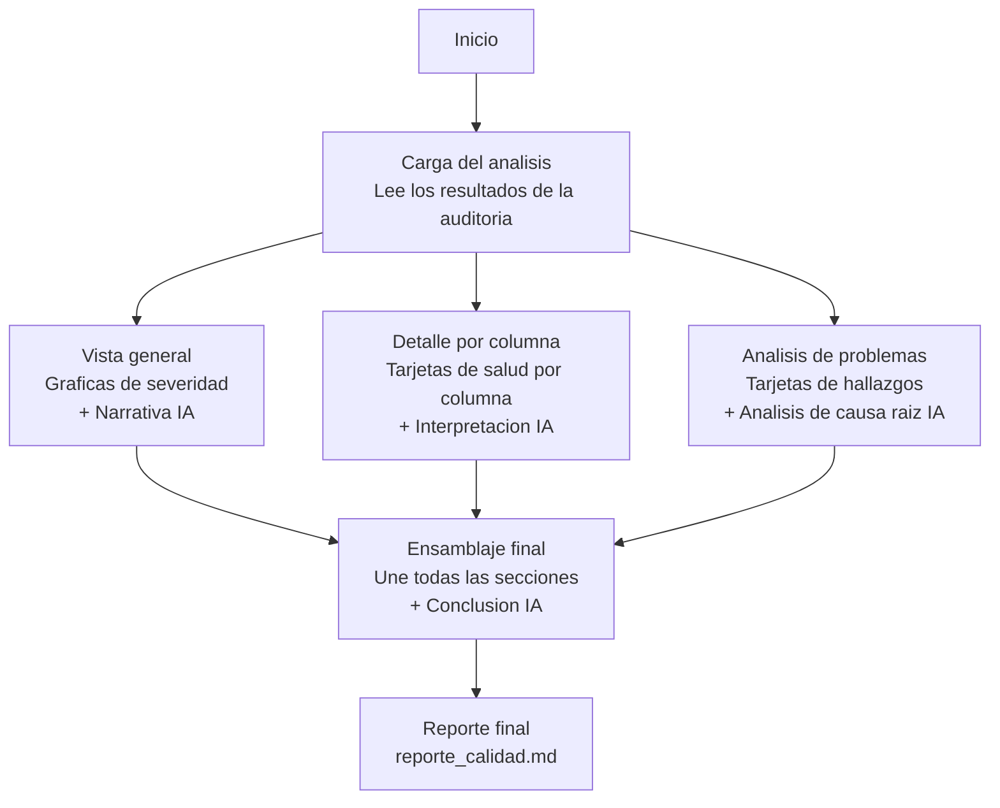
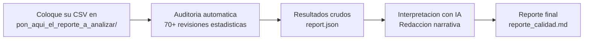

# Data Quality Auditor

Herramienta que revisa automáticamente la calidad de cualquier archivo de datos (CSV), detecta problemas y genera un reporte con calificación, hallazgos y recomendaciones. No requiere configuración previa: basta con pasarle el archivo.

---

## ¿Cómo leer los resultados?

### Calificación general

Cada archivo de datos recibe una **calificación de 0 a 100**, similar a una calificación escolar. Se traduce en un grado con letra:

| Grado | Puntaje | Significado |
|-------|---------|-------------|
| **A** | 90–100 | Excelente. Los datos son confiables para tomar decisiones. |
| **B** | 75–89 | Buena. Hay detalles menores que conviene revisar. |
| **C** | 60–74 | Regular. Existen problemas que podrían afectar análisis y reportes. |
| **D** | 40–59 | Deficiente. Los datos tienen problemas serios; úselos con precaución. |
| **F** | 0–39 | Crítico. Los datos no son confiables; se requiere limpieza urgente. |

### Niveles de alerta

Cada problema encontrado se clasifica en un nivel de gravedad:

| Nivel | Significado | Accion sugerida |
|-------|-------------|-----------------|
| **CRITICAL** | Problema grave que invalida los datos. | Resolver antes de usar los datos para cualquier decision. |
| **HIGH** | Problema importante que puede distorsionar resultados. | Investigar y corregir a la brevedad. |
| **MEDIUM** | Problema moderado que conviene atender. | Revisar y planificar correccion. |
| **LOW** | Detalle menor, no urgente. | Documentar y monitorear. |
| **INFO** | Observacion informativa, no es un problema. | Solo para conocimiento. |

---

## Caracteristicas principales

- **Mas de 70 revisiones automaticas** sobre valores vacios, datos atipicos, duplicados, formatos, tendencias, datos sensibles y mas
- **Reconocimiento inteligente de columnas**: detecta automaticamente si una columna contiene numeros, fechas, categorias, emails, telefonos, IDs, etc. (13 tipos)
- **7 formatos de reporte**: JSON, Markdown, HTML interactivo con graficos, texto plano, Excel con pestanas formateadas, resumen ejecutivo de 1 pagina, y CSV con las filas problematicas
- **Validacion de reglas de negocio**: defina sus propias reglas (ej: "si el pedido esta cancelado, debe haber reembolso")
- **Deteccion de datos sensibles (PII)**: identifica tarjetas de credito, CURP, RFC, emails, telefonos, IPs expuestos en los datos
- **Calificacion configurable**: ajuste los pesos y umbrales segun las prioridades de su organizacion
- **Historial de calidad**: compare la calidad de los datos entre corridas para ver si mejora o empeora
- **Procesamiento masivo**: audite carpetas completas de archivos CSV en una sola ejecucion
- **Deteccion de cambios (drift)**: compare una version actual de datos contra una version de referencia
- **Integridad entre tablas**: valide que las relaciones entre archivos sean consistentes (ej: todo pedido tiene un cliente valido)
- **Validacion de estructura**: verifique que los datos cumplan con una estructura esperada (tipos, rangos, patrones)

---

## Instalacion

```bash
python -m venv venv
source venv/bin/activate
pip install -r requirements.txt
```

## Uso rapido

```bash
# Auditoria basica — genera todos los reportes en outputs/001_nombre/
python data_quality_auditor.py --input datos.csv

# Con estructura esperada y configuracion personalizada
python data_quality_auditor.py --input datos.csv --schema schema.yaml --config config.yaml

# Procesamiento masivo de una carpeta
python data_quality_auditor.py --batch ./carpeta_csvs/

# Comparar dos versiones de datos
python data_quality_auditor.py --input actual.csv --compare referencia.csv

# Modo silencioso (solo codigo de salida)
python data_quality_auditor.py --input datos.csv --quiet
```

## Reportes generados

Cada ejecucion genera automaticamente una carpeta numerada en `outputs/`:

```
outputs/001_datos/
├── report.json              # Datos crudos del analisis (para sistemas)
├── report.md                # Reporte visual en Markdown
├── report.html              # Reporte interactivo con graficos
├── report.txt               # Texto plano
├── report.xlsx              # Excel con pestanas formateadas
├── executive_summary.md     # Resumen ejecutivo de 1 pagina
└── flagged_rows.csv         # Lista de filas con problemas y su motivo
```

## Codigos de salida

| Codigo | Significado |
|--------|-------------|
| 0 | Sin problemas encontrados |
| 1 | Se encontraron problemas (no criticos) |
| 2 | Se encontraron problemas criticos |

## Calificacion (Scoring)

Cada columna inicia con puntaje 100 y se restan puntos por cada problema:

| Nivel del problema | Puntos que se restan |
|--------------------|---------------------|
| CRITICAL | -25 |
| HIGH | -10 |
| MEDIUM | -5 |
| LOW | -2 |
| INFO | 0 (solo informativo) |

**Calificacion del archivo** = promedio ponderado de las calificaciones de todas las columnas. Las columnas con mas datos completos pesan mas.

Todos los pesos son configurables via `config.yaml`.

## Config YAML

```yaml
disabled_checks:
  - BENFORD_LAW
  - ADF_STATIONARITY

severity_overrides:
  MEAN_SHIFT: LOW

scoring:
  CRITICAL: 30
  HIGH: 15

column_weights:
  monto: 5.0
  id_cliente: 3.0

business_rules:
  - name: "Reembolso requiere cancelacion"
    condition: "status == 'cancelado'"
    assertion: "monto_reembolso > 0"
    severity: HIGH

foreign_keys:
  - child_table: ordenes.csv
    child_column: id_cliente
    parent_table: clientes.csv
    parent_column: id
```

## Schema YAML

```yaml
columns:
  nombre:
    type: categorical
    not_null: true
  monto:
    type: numeric
    min: 0
    max: 100000
  email:
    type: email
    pattern: "^[a-z]+@empresa\\.com$"

composite_keys:
  - [id_orden, id_producto]
```

## Tests

```bash
python -m pytest tests/ -v
```

89 tests unitarios cubriendo todas las categorias de checks, scoring, reportes y funcionalidades avanzadas.

---

## Arquitectura — ¿Como funciona?

### El proceso completo en 6 pasos



### ¿Como clasifica cada columna?

La herramienta analiza automaticamente cada columna y decide que tipo de dato contiene, para aplicar las pruebas correctas:



### Generacion del reporte con IA (opcional)

Cuando se usa el reporte con inteligencia artificial, el proceso genera graficas y tablas de forma determinista (exacta), y usa un modelo de lenguaje solo para redactar la interpretacion narrativa:



### Flujo en un solo paso (start.sh)



## Tecnologias

pandas, numpy, scipy, statsmodels, chardet, rapidfuzz, python-dateutil, pymannkendall, openpyxl, pyyaml.

---

## Glosario de Pruebas

Inventario completo de las **72+ revisiones** que ejecuta la herramienta, organizadas por categoria. Cada prueba puede deshabilitarse o ajustarse via `config.yaml`.

> **¿Como leer las tablas?** Cada fila describe una revision. La columna "¿Por que importa?" explica el impacto en terminos de negocio. La columna "Niveles de alerta" indica cuando la herramienta considera el problema leve, moderado o grave.

---

### Revisiones universales (5)

Se aplican a **todas** las columnas, sin importar el tipo de dato.

| Prueba | ¿Que revisa? | ¿Por que importa? | Niveles de alerta |
|--------|-------------|-------------------|-------------------|
| `NULL_RATE` | Porcentaje de celdas vacias o sin valor | Datos vacios significan informacion perdida. Si mas del 20% de una columna esta vacia, los promedios, conteos y reportes basados en ella pueden ser enganosos. | CRITICAL (>=50%), HIGH (>=20%), MEDIUM (>=5%), LOW (>=1%) |
| `DUPLICATE_ROWS` | Filas completamente repetidas | Filas duplicadas inflan conteos, sumas y promedios. Un 5% de duplicados en una tabla de ventas puede significar reportar ingresos de mas. | CRITICAL (>=10%), HIGH (>=5%), MEDIUM (>=1%) |
| `WHITESPACE_ISSUES` | Espacios invisibles al inicio o final de los valores | Causan que filtros y agrupaciones fallen silenciosamente. "Mexico" y "Mexico " se cuentan como categorias distintas. | MEDIUM (>10%), LOW (>1%), INFO (>0) |
| `CONSTANT_COLUMN` | Columna donde todas las filas tienen el mismo valor | Una columna constante no aporta informacion util. Puede indicar un error de extraccion o un campo obsoleto. | LOW |
| `NEAR_CONSTANT` | Un solo valor representa 95% o mas de las filas | Similar a constante: la columna casi no tiene variacion. Puede distorsionar modelos o indicar un problema en la fuente de datos. | LOW |

---

### Revisiones numericas (11)

Se aplican a columnas que contienen numeros (montos, cantidades, mediciones, calificaciones).

| Prueba | ¿Que revisa? | ¿Por que importa? | Niveles de alerta |
|--------|-------------|-------------------|-------------------|
| `OUTLIER_IQR` | Valores inusualmente altos o bajos respecto al rango tipico | Un monto de $999,999 cuando el promedio es $500 puede ser un error de captura, un fraude, o un caso real que merece atencion. Este metodo es robusto incluso si los datos no siguen una campana de Gauss. | CRITICAL (>=10%), HIGH (>=5%), MEDIUM (>=2%), LOW (>=0.5%) |
| `OUTLIER_ZSCORE` | Valores extremadamente alejados del promedio | Identifica datos que estan a mas de 3 desviaciones del promedio. Util cuando los datos se comportan como una campana de Gauss. | CRITICAL (>=5%), HIGH (>=2%), MEDIUM (>=1%) |
| `OUTLIER_MODIFIED_Z` | Valores atipicos usando un metodo robusto (basado en la mediana) | Version mejorada del anterior: funciona bien incluso cuando los datos estan sesgados (ej: muchos montos bajos y pocos muy altos). | CRITICAL (>=5%), HIGH (>=2%), MEDIUM (>=1%) |
| `DISTRIBUTION_SKEW` | Datos muy cargados hacia un lado (asimetria) | Si las ventas estan muy sesgadas a la izquierda, el promedio no representa bien al grupo. Mejor usar la mediana para decisiones. | HIGH (extrema), MEDIUM (moderada), LOW (leve) |
| `DISTRIBUTION_KURTOSIS` | Datos con colas muy pesadas (valores extremos frecuentes) | Indica que los valores extremos son mas comunes de lo esperado. En finanzas, esto significa mayor riesgo del anticipado. | HIGH (muy pesada), MEDIUM (pesada), LOW (moderada) |
| `NEGATIVE_VALUES` | Presencia de numeros negativos | En columnas como "monto" o "edad", un negativo suele ser error. En "saldo" puede ser normal. Depende del contexto, pero la herramienta lo senala. | MEDIUM (>20%), INFO (<20%) |
| `ZERO_VALUES` | Porcentaje de valores en cero | Demasiados ceros en "ventas" o "monto" puede indicar registros incompletos o errores de carga. | HIGH (>30%), MEDIUM (>10%) |
| `TREND_CHANGE` | Cambio repentino en el promedio de los datos recientes | Si el monto promedio de los ultimos registros es muy diferente al historico, algo cambio: nuevo producto, error de sistema, o cambio de politica. | CRITICAL (cambio extremo), HIGH (cambio fuerte), MEDIUM (cambio notable) |
| `VALUE_RANGE` | Valores fuera del rango esperado (percentil 0.1 a 99.9) | Reporta los valores mas extremos para revision manual. No necesariamente son errores, pero merecen una segunda mirada. | INFO |
| `VARIANCE_SUDDEN_CHANGE` | Cambio abrupto en la variabilidad de los datos | Si la primera mitad de los datos es estable y la segunda es muy volatil (o viceversa), puede indicar un cambio en el proceso o fuente. | HIGH (cambio 5x), MEDIUM (cambio 3x), LOW (cambio 2x) |
| `NORMALITY_TEST` | Verifica si los datos siguen una distribucion tipo "campana" | Muchas formulas estadisticas asumen datos con forma de campana. Si no la tienen, hay que usar metodos alternativos. Es informativo, no un problema en si. | INFO (no sigue campana), PASS (si sigue) |

---

### Revisiones de fechas (9)

Se aplican a columnas que contienen fechas u horas.

| Prueba | ¿Que revisa? | ¿Por que importa? | Niveles de alerta |
|--------|-------------|-------------------|-------------------|
| `DATE_NULL_RATE` | Fechas vacias o que no se pudieron interpretar | Una fecha de transaccion vacia hace imposible ubicar el evento en el tiempo. Afecta reportes mensuales, anuales y tendencias. | CRITICAL (>=50%), HIGH (>=20%), MEDIUM (>=5%), LOW (>0%) |
| `DATE_FORMAT_MIX` | Mezcla de formatos en la misma columna (ej: "01/02/2024" y "2024-02-01") | Formatos mezclados causan que "01/02" se interprete como enero 2 o febrero 1, segun la region. Puede generar errores graves en reportes temporales. | CRITICAL (>=4 formatos), HIGH (>=2) |
| `DATE_FUTURE` | Fechas posteriores a hoy | Una fecha de nacimiento o de compra en el futuro es casi siempre un error. | HIGH (>10%), MEDIUM (>0%) |
| `DATE_ANCIENT` | Fechas anteriores al ano 1900 | Probablemente un error de captura o un valor placeholder como "01/01/1900" usado en lugar de dejar vacio. | HIGH |
| `DATE_SEQUENCE_GAPS` | Huecos inesperados en una secuencia temporal | Si se esperan datos diarios y faltan semanas enteras, hay un problema de extraccion o de operacion que dejo de reportar. | HIGH (>10 huecos), MEDIUM (>3), LOW (>0) |
| `DATE_DUPLICATES` | Fechas repetidas | En datos que deberian tener una fecha unica por registro (ej: cierre diario), las repeticiones indican duplicacion de datos. | MEDIUM (>50%), LOW (>10%), INFO (>0%) |
| `DATE_MONOTONICITY` | Verifica si las fechas estan en orden cronologico | Datos desordenados temporalmente pueden causar errores en calculos de diferencias, tendencias y acumulados. | INFO |
| `DATE_INVALID_PARSED` | Valores que parecen fecha pero no se pueden interpretar | "31/02/2024" o "fecha_pendiente" en una columna de fecha indica problemas de captura o validacion en el origen. | HIGH (>20%), MEDIUM (>5%), LOW (>0%) |
| `TEMPORAL_DRIFT` | Los datos del inicio del archivo se comportan distinto a los del final | Si las ventas de enero tienen una distribucion muy diferente a las de diciembre, puede haber un cambio real de mercado o un problema en la captura. | HIGH (diferencia extrema), MEDIUM (diferencia notable) |

---

### Revisiones de categorias (6)

Se aplican a columnas con opciones repetidas (ej: estado, tipo de producto, region).

| Prueba | ¿Que revisa? | ¿Por que importa? | Niveles de alerta |
|--------|-------------|-------------------|-------------------|
| `RARE_CATEGORIES` | Categorias que aparecen en menos del 0.5% de los registros | Categorias muy raras pueden ser errores de captura, typos, o datos que deberian agruparse con otra categoria. | MEDIUM (>10 raras), LOW (pocas) |
| `CARDINALITY_CHANGE` | Cuantas opciones distintas tiene la columna | Informativo: si un campo "tipo_producto" tiene 500 opciones distintas, puede que no sea realmente una categoria sino texto libre. | INFO |
| `CASE_INCONSISTENCY` | Misma categoria escrita diferente (ej: "Mexico", "MEXICO", "mexico") | Causa que los conteos se fragmenten. Un reporte de ventas por region mostraria "Mexico" tres veces con cifras parciales. | MEDIUM (>5 casos), LOW (pocos) |
| `ENCODING_ANOMALY` | Caracteres extranos o ilegibles (ej: "México" en vez de "Mexico") | Indica problemas de codificacion en la fuente. Los datos se ven corruptos y los filtros no funcionan correctamente. | HIGH (>5%), MEDIUM (>0%) |
| `CLASS_IMBALANCE` | Una sola opcion domina mas del 90% | Si el 95% de los clientes son "Activo", la columna aporta poca informacion. Tambien puede indicar que no se estan capturando los otros estados. | HIGH (>=95%), MEDIUM (>=90%) |
| `TYPO_CANDIDATES` | Categorias muy parecidas que podrian ser el mismo valor (ej: "Guadalajra" y "Guadalajara") | Identifica posibles errores de dedo comparando la similitud entre nombres. Cada variante se cuenta por separado en reportes. | MEDIUM (>5 pares), LOW (pocos) |

---

### Revisiones de texto (5)

Se aplican a columnas de texto, email y telefono.

| Prueba | ¿Que revisa? | ¿Por que importa? | Niveles de alerta |
|--------|-------------|-------------------|-------------------|
| `EMAIL_FORMAT` | Emails con formato invalido (ej: falta @, dominio incompleto) | Emails invalidos significan que no se puede contactar al cliente. Afecta campanas de marketing y comunicaciones. | HIGH (>20%), MEDIUM (>5%), LOW (>0%) |
| `PHONE_FORMAT` | Telefonos con formato inesperado | Telefonos mal formateados no se pueden usar para contacto, SMS marketing o verificacion de identidad. | HIGH (>20%), MEDIUM (>5%), LOW (>0%) |
| `LENGTH_OUTLIERS` | Textos inusualmente cortos o largos respecto al resto | Un nombre de 1 caracter o una direccion de 500 caracteres probablemente son errores de captura o datos pegados en el campo equivocado. | MEDIUM (>10%), LOW (>2%), INFO (>0%) |
| `NULL_LIKE_STRINGS` | Textos que dicen "N/A", "null", "none", "-", "?" etc. en vez de estar vacios | Estos valores no se cuentan como vacios en las estadisticas, pero tampoco son datos reales. Inflan el conteo de registros "completos" falsamente. | HIGH (>10%), MEDIUM (>2%), LOW (>0%) |
| `TRUNCATION_SIGNS` | Textos que parecen cortados (terminan en "..." o se interrumpen) | Indica que la fuente de datos tiene un limite de caracteres y esta cortando informacion. Direcciones, nombres o descripciones incompletas. | MEDIUM (>5%), LOW (>0%) |

---

### Revisiones de identificadores (3)

Se aplican a columnas que parecen ser IDs o claves unicas (ej: id_cliente, numero_orden).

| Prueba | ¿Que revisa? | ¿Por que importa? | Niveles de alerta |
|--------|-------------|-------------------|-------------------|
| `ID_DUPLICATES` | IDs que se repiten | Un ID deberia ser unico. Si el id_cliente "12345" aparece en dos filas distintas, puede haber duplicacion de registros que infla todas las metricas. | CRITICAL (>=1%), HIGH (>0) |
| `ID_FORMAT_CONSISTENCY` | IDs con formatos inconsistentes (ej: "CLI-001", "1234", "cli_002") | Formatos mezclados dificultan cruces entre tablas y pueden causar que llaves foraneas no hagan match. | HIGH (muy inconsistente), MEDIUM (moderado), LOW (leve) |
| `ID_NULL` | IDs vacios | Un registro sin identificador no se puede rastrear, cruzar con otras tablas ni desduplicar. Es un problema critico de integridad. | CRITICAL |

---

### Pruebas estadisticas avanzadas — Numericas (7)

La herramienta primero determina si los datos siguen una distribucion tipo "campana" (normal). Segun el resultado, elige la prueba estadistica mas apropiada.

| Prueba | ¿Que revisa? | ¿Por que importa? | Niveles de alerta |
|--------|-------------|-------------------|-------------------|
| `NORMALITY_ANDERSON` | ¿Los datos se distribuyen como campana de Gauss? (metodo Anderson-Darling) | Saber si los datos son "normales" determina que formulas son validas para analizarlos. Prueba sensible a comportamientos en los extremos. | INFO (no es campana), PASS (si es) |
| `NORMALITY_LILLIEFORS` | Misma pregunta, metodo alternativo (Lilliefors) | Complementa la prueba anterior. Util cuando no se conocen de antemano las caracteristicas de los datos. | INFO (no es campana), PASS (si es) |
| `MEAN_SHIFT` | ¿El promedio cambio significativamente entre la primera y segunda mitad de los datos? | Un cambio estadisticamente comprobado en el promedio sugiere que algo cambio en el proceso: nueva politica, error de sistema, estacionalidad. | HIGH (cambio >20%), MEDIUM (cambio significativo) |
| `WILCOXON_PAIRED` | ¿Hay diferencia significativa al comparar pares de datos? | Version robusta de la comparacion anterior que no requiere datos tipo campana. Valida incluso con datos sesgados. | MEDIUM (significativo) |
| `VARIANCE_SHIFT` | ¿La dispersion de los datos cambio entre la primera y segunda mitad? | Si los montos antes eran estables (ej: $400-$600) y ahora varian mucho (ej: $100-$2000), algo cambio en el proceso. | HIGH (cambio >3x), MEDIUM (significativo) |
| `KS_GOODNESS_FIT` | ¿Los datos se ajustan a una distribucion teorica esperada? | Informativo: ayuda a entender la forma de los datos para elegir los metodos de analisis correctos. | INFO (no se ajusta), PASS (si se ajusta) |
| `ADF_STATIONARITY` | ¿Los datos tienen un comportamiento estable en el tiempo, o hay una tendencia? | Si hay tendencia (ej: ventas subiendo mes a mes), los promedios historicos no sirven para predecir el futuro. Hay que usar metodos de series de tiempo. | MEDIUM (inestable), LOW (marginalmente estable) |

---

### Pruebas estadisticas avanzadas — Categoricas (2)

| Prueba | ¿Que revisa? | ¿Por que importa? | Niveles de alerta |
|--------|-------------|-------------------|-------------------|
| `CHI2_INDEPENDENCE` | ¿Dos columnas categoricas estan relacionadas entre si? | Si "region" y "tipo_producto" estan fuertemente asociadas, un cambio en la mezcla regional afecta automaticamente la mezcla de productos. Importante para planificacion. | MEDIUM (asociacion fuerte), LOW (asociacion moderada) |
| `KRUSKAL_WALLIS` | ¿Los valores numericos varian significativamente entre grupos categoricos? | Si el "monto_venta" es muy diferente entre regiones, vale la pena segmentar el analisis. | INFO |

---

### Ley de Benford (1)

| Prueba | ¿Que revisa? | ¿Por que importa? | Niveles de alerta |
|--------|-------------|-------------------|-------------------|
| `BENFORD_LAW` | ¿La distribucion del primer digito de los numeros sigue el patron natural esperado? | En datos financieros y contables reales, el digito "1" aparece como primer digito ~30% de las veces, el "2" ~17%, etc. Si los datos no siguen este patron, puede indicar datos fabricados, redondeados artificialmente o manipulados. Es una herramienta clasica de auditoria forense. | MEDIUM (no conforme), LOW (marginalmente conforme), PASS (conforme) |

---

### Deteccion de datos sensibles — PII (1 prueba, 8 tipos)

Escanea **todas** las columnas buscando datos personales que no deberian estar expuestos.

| Prueba | ¿Que detecta? | ¿Por que importa? | Severidad |
|--------|--------------|-------------------|-----------|
| `PII_DETECTED` | **Tarjetas de credito** — Numeros que pasan validacion Luhn | Exposicion de datos financieros. Riesgo regulatorio y de fraude. | CRITICAL |
| | **SSN (EE.UU.)** — Numeros de seguro social | Informacion personal sensible. Violacion de privacidad. | CRITICAL |
| | **CURP (Mexico)** — Clave unica de registro de poblacion | Documento de identidad nacional. Riesgo de robo de identidad. | CRITICAL |
| | **RFC (Mexico)** — Registro federal de contribuyentes | Informacion fiscal. Riesgo de suplantacion. | HIGH |
| | **Email** — Direcciones de correo electronico | Dato personal. Sujeto a regulaciones de privacidad (GDPR, LFPDPPP). | HIGH |
| | **IBAN** — Numeros de cuenta bancaria internacional | Informacion financiera sensible. | HIGH |
| | **Telefonos internacionales** — Numeros telefonicos | Dato personal de contacto. | MEDIUM |
| | **Direcciones IP** — Direcciones IPv4 | Pueden identificar ubicacion y dispositivo del usuario. | MEDIUM |

---

### Relaciones entre columnas (4)

Revisan como se relacionan las columnas **entre si** a nivel de todo el archivo.

| Prueba | ¿Que revisa? | ¿Por que importa? | Niveles de alerta |
|--------|-------------|-------------------|-------------------|
| `HIGH_CORRELATION` | Dos columnas numericas que se mueven juntas (correlacion >85%) | Si "precio" y "costo" estan correlacionadas al 98%, una de las dos podria ser redundante. Tambien puede revelar formulas ocultas o columnas derivadas. | HIGH (>95%), MEDIUM (>85%) |
| `MULTICOLLINEARITY_VIF` | Una columna que se puede predecir a partir de las demas | Si una columna es combinacion de otras, incluirla en modelos o analisis causa resultados inestables y poco confiables. | HIGH (muy predecible), MEDIUM (moderadamente predecible) |
| `CATEGORICAL_ASSOCIATION` | Dos columnas categoricas que estan fuertemente asociadas | Si "ciudad" y "codigo_postal" siempre van juntos, solo se necesita una para segmentar. | MEDIUM |
| `POINT_BISERIAL` | Relacion entre una columna numerica y una de Si/No | Revela si un indicador binario (ej: "es_premium") esta asociado con un valor numerico (ej: "monto_compra"). Util para validar logica de negocio. | INFO |

---

### Patrones de datos faltantes (3)

Analizan la **estructura** de los datos vacios para entender si faltan por casualidad o por una razon sistematica.

| Prueba | ¿Que revisa? | ¿Por que importa? | Niveles de alerta |
|--------|-------------|-------------------|-------------------|
| `NULL_CORRELATION` | Cuando falta dato en una columna, ¿tiende a faltar tambien en otra? | Si "email" y "telefono" siempre estan vacios juntos, probablemente hay un problema en el proceso de captura de datos de contacto, no dos problemas separados. | MEDIUM |
| `NULL_ROW_PATTERN` | Filas donde mas de la mitad de las columnas estan vacias | Filas casi vacias generalmente son basura: registros fallidos, pruebas, o errores de carga que deberian eliminarse. | HIGH (>10%), MEDIUM (>5%), LOW (>0%) |
| `MCAR_VIOLATION` | ¿Los datos vacios siguen un patron sistematico (no son aleatorios)? | Si los datos faltantes NO son aleatorios, simplemente ignorarlos introduce sesgo. Ej: si solo faltan ingresos de personas de alto poder adquisitivo, el ingreso promedio reportado sera menor al real. | HIGH (patron claro), MEDIUM (patron leve) |

---

### Comportamiento en el tiempo (3)

Se activan cuando el archivo tiene una columna de fecha.

| Prueba | ¿Que revisa? | ¿Por que importa? | Niveles de alerta |
|--------|-------------|-------------------|-------------------|
| `AUTOCORRELATION` | ¿El valor de hoy esta relacionado con el de ayer, el de la semana pasada, etc.? | Si las ventas de hoy dependen de las de ayer, los datos no son independientes y se necesitan metodos especiales de analisis (series de tiempo). | MEDIUM (muchas dependencias), INFO (pocas) |
| `SEASONALITY` | ¿Hay patrones que se repiten ciclicamente (semanal, mensual, anual)? | Si las ventas tienen patron estacional, comparar "julio vs diciembre" sin ajustar estacionalidad lleva a conclusiones erroneas. | INFO |
| `CHANGEPOINT_CUSUM` | ¿Hubo un momento donde el comportamiento de los datos cambio abruptamente? | Detecta el "punto de quiebre": cuando las ventas dejaron de crecer, cuando los errores empezaron a subir, o cuando una politica nueva surtio efecto. | MEDIUM (cambio claro), LOW (cambio en los bordes) |

---

### Completitud por periodo (2)

Se activan cuando el archivo tiene una columna de fecha.

| Prueba | ¿Que revisa? | ¿Por que importa? | Niveles de alerta |
|--------|-------------|-------------------|-------------------|
| `TEMPORAL_COMPLETENESS` | ¿En algun periodo hay el doble de datos faltantes que el promedio? | Si en marzo faltan muchos mas datos que en otros meses, hubo un problema de captura en ese periodo. Los reportes de marzo no son comparables con los demas. | HIGH (periodo con >50% vacios), MEDIUM (degradacion notable) |
| `TEMPORAL_NULL_CONCENTRATION` | ¿Los datos faltantes de una columna estan concentrados en pocos periodos? | Si la columna "monto" esta vacia solo en Q4, el reporte anual de montos subreportara el cuarto trimestre. | MEDIUM |

---

### Validacion de estructura (9)

Se activan solo cuando se proporciona un archivo de estructura esperada (`--schema schema.yaml`).

| Prueba | ¿Que revisa? | ¿Por que importa? | Niveles de alerta |
|--------|-------------|-------------------|-------------------|
| `SCHEMA_MISSING_COLUMN` | Falta una columna que deberia existir | Si su proceso espera una columna "monto" y no existe, todo lo que dependa de ella fallara. | CRITICAL |
| `SCHEMA_EXTRA_COLUMNS` | Hay columnas que no estan en la estructura esperada | Pueden ser columnas nuevas legitimas o basura. Conviene revisar para mantener la estructura limpia. | INFO |
| `SCHEMA_TYPE_MISMATCH` | El tipo de dato detectado no coincide con el esperado | Si "monto" deberia ser numerico pero se detecto como texto, probablemente hay valores como "$1,000" que impiden el calculo. | HIGH |
| `SCHEMA_NOT_NULL` | Hay valores vacios en una columna que deberia estar siempre llena | Si el "id_cliente" esta marcado como obligatorio pero tiene vacios, hay registros sin identificar. | HIGH |
| `SCHEMA_UNIQUE_VIOLATION` | Hay duplicados en una columna que deberia tener valores unicos | Si el "numero_orden" deberia ser unico pero se repite, hay ordenes duplicadas o un problema de identidad. | HIGH |
| `SCHEMA_RANGE_VIOLATION` | Valores fuera del rango esperado (ej: edad=-5 o edad=200) | Validacion basica de limites que atrapa errores de captura evidentes. | HIGH |
| `SCHEMA_ALLOWED_VALUES` | Valores que no estan en la lista de opciones validas | Si "tipo_pago" solo puede ser "efectivo", "tarjeta" o "transferencia", cualquier otra cosa es un error. | HIGH |
| `SCHEMA_PATTERN_VIOLATION` | Valores que no cumplen el formato esperado (ej: RFC debe tener 13 caracteres) | Atrapa valores que "parecen" correctos pero no cumplen las reglas de formato de su organizacion. | MEDIUM |
| `COMPOSITE_KEY_VIOLATION` | Combinaciones de columnas que deberian ser unicas, pero se repiten | Si la combinacion "id_orden + id_producto" deberia ser unica pero se repite, hay lineas duplicadas en el detalle. | HIGH |

---

### Reglas de negocio (1)

Se activan solo cuando se definen reglas personalizadas en la configuracion.

| Prueba | ¿Que revisa? | ¿Por que importa? | Niveles de alerta |
|--------|-------------|-------------------|-------------------|
| `BUSINESS_RULE` | Reglas condicionales definidas por su organizacion | Permite validar logica especifica de su negocio. Ejemplo: "si el pedido esta cancelado, debe existir un monto de reembolso". Detecta violaciones a sus propias politicas. | Configurable (CRITICAL, HIGH, MEDIUM, LOW) |

---

### Deteccion de cambios entre versiones (Drift)

Se activa al comparar dos archivos (`--compare referencia.csv`). Identifica que cambio entre una version de referencia y la version actual.

| Que compara | ¿Por que importa? |
|-------------|-------------------|
| **Columnas agregadas o eliminadas** | La estructura del archivo cambio. Puede romper procesos que dependen de columnas especificas. |
| **Cambio en tasa de datos vacios** | Si antes una columna tenia 2% de vacios y ahora tiene 25%, algo cambio en la fuente. |
| **Cambio en numero de categorias** | Si "tipo_producto" tenia 10 opciones y ahora tiene 50, puede haber un problema de estandarizacion. |
| **Cambio en distribucion de numeros** | Si la distribucion de "monto" cambio significativamente, el comportamiento del negocio o la captura cambiaron. |
| **Cambio en volumen de datos** | Una caida o crecimiento abrupto en el numero de filas puede indicar problemas de extraccion. |

---

## Glosario de Conceptos

Explicacion en lenguaje sencillo de los metodos y terminos que aparecen en los reportes.

### ¿Como se detectan los valores atipicos?

| Concepto | Explicacion |
|----------|------------|
| **IQR (Rango Intercuartilico)** | Imagina que ordenas todos los valores de menor a mayor. El IQR es el rango que cubre el 50% central de los datos. Cualquier valor que este demasiado lejos de ese rango central se marca como atipico. Es el metodo mas confiable porque no se deja enganar por los propios valores extremos. |
| **Z-score** | Mide cuantas "desviaciones tipicas" se aleja un valor del promedio. Si un valor esta a mas de 3 desviaciones, es atipico. Funciona bien cuando los datos tienen forma de campana, pero puede fallar con datos sesgados. |
| **Modified Z-score (MAD)** | Version mejorada del Z-score que usa la mediana en lugar del promedio. La mediana no se deja influir por los extremos, asi que este metodo es mas confiable cuando los datos estan sesgados (muchos valores bajos y pocos muy altos, o viceversa). |

### ¿Que forma tienen mis datos?

| Concepto | Explicacion |
|----------|------------|
| **Skewness (Asimetria)** | Indica si los datos estan "cargados" hacia un lado. Asimetria positiva = muchos valores bajos con algunos muy altos (tipico de ingresos o ventas). Asimetria negativa = muchos valores altos con algunos muy bajos. Si hay mucha asimetria, el promedio puede ser enganoso; es mejor usar la mediana. |
| **Kurtosis (Curtosis)** | Mide que tan frecuentes son los valores extremos. Una kurtosis alta significa que hay mas valores extremos de lo esperado (las "colas" de la distribucion son pesadas). En terminos de negocio: mayor kurtosis = mayor riesgo de sorpresas. |

### ¿Mis datos siguen una distribucion "normal" (campana de Gauss)?

Muchos calculos estadisticos asumen que los datos tienen forma de campana. Estas pruebas verifican si eso es cierto, para saber que metodos de analisis son validos.

| Test | Explicacion |
|------|------------|
| **Shapiro-Wilk** | La prueba mas potente para muestras de hasta 5,000 datos. Si dice que no es campana, probablemente no lo es. |
| **D'Agostino-K squared** | Funciona bien con muestras grandes. Verifica tanto la asimetria como la curtosis al mismo tiempo. |
| **Anderson-Darling** | Pone especial atencion en los valores extremos (las colas). Util si le preocupan los outliers. |
| **Lilliefors** | Similar al test KS pero mas preciso cuando no se conocen de antemano las caracteristicas de los datos. |

### ¿Cambio el comportamiento de mis datos?

Estas pruebas comparan dos grupos de datos (generalmente la primera mitad vs la segunda mitad del archivo) para detectar cambios.

| Test | Explicacion |
|------|------------|
| **Welch t-test** | Compara el promedio de dos grupos. Si el promedio de ventas de enero-junio es significativamente diferente al de julio-diciembre, lo detecta. Requiere datos tipo campana. |
| **Mann-Whitney U** | Hace lo mismo que Welch pero funciona con cualquier tipo de distribucion. La herramienta lo elige automaticamente cuando los datos no son tipo campana. |
| **Wilcoxon** | Compara datos pareados (ej: antes y despues de un cambio). No requiere datos tipo campana. |
| **Bartlett / Levene** | Comparan si la variabilidad (dispersion) cambio entre dos grupos. Bartlett es mas preciso con datos campana; Levene funciona con cualquier distribucion. |
| **Kruskal-Wallis** | Compara mas de 2 grupos a la vez. Ejemplo: ¿los montos de venta son diferentes entre las 4 regiones? |

### ¿Mis columnas estan relacionadas entre si?

| Concepto | Explicacion |
|----------|------------|
| **Correlacion (Pearson)** | Mide si dos columnas numericas se mueven juntas. Va de -1 a +1. Ejemplo: si cuando sube el precio tambien sube el costo, la correlacion es alta y positiva. Una correlacion >0.85 sugiere posible redundancia. |
| **VIF (Factor de Inflacion de Varianza)** | Mide si una columna se puede predecir a partir de las demas. VIF > 5 significa que esa columna no aporta informacion nueva. VIF > 10 es un problema serio que distorsiona cualquier modelo estadistico o de machine learning. |
| **V de Cramer** | Version de correlacion para categorias (no numeros). Mide que tan asociadas estan dos columnas categoricas. Va de 0 (sin relacion) a 1 (completamente asociadas). |
| **Point-biserial** | Mide la relacion entre una columna numerica y una de Si/No. Ejemplo: ¿los clientes "premium" gastan significativamente mas? |
| **Chi-cuadrado** | Prueba si dos columnas categoricas son independientes entre si. Ejemplo: ¿el metodo de pago depende de la region? |
| **KS test (Kolmogorov-Smirnov)** | Compara si dos conjuntos de numeros tienen la misma distribucion. Se usa para detectar drift entre versiones de datos. |

### ¿Mis datos tienen comportamiento temporal?

| Concepto | Explicacion |
|----------|------------|
| **Estacionariedad (ADF test)** | Verifica si los datos se comportan de manera estable en el tiempo. Si hay una tendencia al alza o a la baja, los datos NO son estacionarios y necesitan tratamiento especial para analizarlos correctamente. |
| **Autocorrelacion (ACF)** | Mide si el valor de hoy esta relacionado con los dias anteriores. Ejemplo: si las ventas del lunes siempre predicen las del martes, hay autocorrelacion. Significa que los datos no son independientes entre si. |
| **Estacionalidad (STL)** | Detecta patrones que se repiten periodicamente: semanal, mensual, trimestral, anual. Importante para no comparar "manzanas con naranjas" (ej: ventas de diciembre vs enero). |
| **Punto de cambio (CUSUM)** | Identifica el momento exacto donde los datos cambiaron de comportamiento. Ejemplo: "a partir del 15 de marzo, el promedio de errores subio un 40%". Util para correlacionar con eventos de negocio. |

### ¿Por que faltan datos?

| Concepto | Explicacion |
|----------|------------|
| **MCAR (Faltantes completamente al azar)** | Los datos faltan por casualidad, sin patron. Es el mejor escenario: se pueden ignorar o imputar sin introducir sesgo. Ejemplo: una encuesta donde algunas personas simplemente se saltaron una pregunta al azar. |
| **MAR (Faltantes al azar condicionado)** | Los datos faltan por una razon relacionada con otros datos que SI tenemos. Ejemplo: las personas jovenes tienden a no reportar su ingreso. Podemos corregir el sesgo usando la variable "edad". |
| **MNAR (Faltantes no al azar)** | Los datos faltan por una razon relacionada con el propio valor faltante. Ejemplo: las personas con ingresos muy altos no reportan su ingreso PORQUE es alto. Es el peor escenario porque no se puede corregir facilmente. |

### Ley de Benford

| Concepto | Explicacion |
|----------|------------|
| **Ley de Benford** | En datos numericos que ocurren naturalmente (ventas, poblaciones, facturas, gastos), el primer digito NO se distribuye uniformemente. El digito "1" aparece primero ~30% de las veces, el "2" ~17%, el "3" ~12%, y asi decreciendo hasta el "9" con solo ~4.6%. Si sus datos financieros no siguen este patron, puede ser una senal de numeros inventados, redondeados artificialmente o manipulados. Es una herramienta clasica de auditoria forense y deteccion de fraude. |

### Datos sensibles (PII)

PII significa "Informacion Personal Identificable" — cualquier dato que pueda identificar a una persona. Su exposicion en archivos de datos puede violar regulaciones de privacidad (LFPDPPP en Mexico, GDPR en Europa) y generar riesgos legales y reputacionales.

| Tipo | Que es |
|------|--------|
| **Tarjeta de credito** | 16 digitos que identifican una tarjeta de pago. Su exposicion permite fraude financiero. |
| **SSN** | Numero de Seguro Social de EE.UU. Equivale al NSS/CURP en Mexico. |
| **CURP** | Clave Unica de Registro de Poblacion (Mexico). 18 caracteres que identifican unicamente a cada ciudadano. |
| **RFC** | Registro Federal de Contribuyentes (Mexico). Identificador fiscal de personas y empresas. |
| **IBAN** | Numero de cuenta bancaria internacional. Permite transferencias e identifica al titular. |
| **Email / Telefono / IP** | Datos de contacto y ubicacion que permiten identificar y rastrear a una persona. |

### Tipos de columna que reconoce la herramienta (13)

La herramienta analiza cada columna y la clasifica automaticamente para aplicar las pruebas mas relevantes:

| Tipo | Ejemplo | Descripcion |
|------|---------|-------------|
| Vacia | (sin datos) | Toda la columna esta vacia. No se aplican pruebas. |
| Constante | Siempre dice "Mexico" | Un solo valor en toda la columna. No aporta informacion. |
| Booleano | Si/No, Verdadero/Falso, 1/0 | Solo dos opciones posibles. |
| Numero continuo | 1,234.56, 0.003, 98765 | Numeros con muchos valores distintos (montos, mediciones, temperaturas). |
| Numero discreto | 1, 2, 3, 4, 5 | Numeros con pocas opciones (calificaciones, ratings, codigos). |
| Fecha | 2024-01-15, 15/01/2024 | Fechas sin hora. |
| Fecha con hora | 2024-01-15 14:30:00 | Fechas que incluyen hora, minuto, segundo. |
| Email | usuario@empresa.com | Direcciones de correo electronico. |
| Telefono | +52 55 1234 5678 | Numeros telefonicos. |
| Identificador | CLI-00123, ORD-98765 | Codigos o IDs con alta unicidad. |
| Categoria | "Activo", "Cancelado", "Pendiente" | Opciones que se repiten (pocas opciones distintas). |
| Texto variado | Nombres, direcciones, descripciones | Texto con muchas opciones distintas. |
| Mezcla | "123", "abc", "2024-01-01" | Columna con tipos mezclados que no encaja en otra categoria. |

### Sistema de calificacion

| Concepto | Explicacion |
|----------|------------|
| **Puntaje de columna** | Cada columna inicia con 100 puntos. Se restan puntos por cada problema encontrado: -25 por critico, -10 por alto, -5 por medio, -2 por bajo. El minimo es 0. |
| **Puntaje del archivo** | Promedio ponderado de todas las columnas. Las columnas con mas datos completos pesan mas, porque son mas confiables para evaluar. |
| **Grados (A-F)** | A (90+) = Excelente, B (75+) = Buena, C (60+) = Regular, D (40+) = Deficiente, F (<40) = Critico. Similar a una calificacion escolar. |
| **Niveles de alerta** | CRITICAL = resolver antes de usar los datos. HIGH = investigar pronto. MEDIUM = planificar correccion. LOW = monitorear. INFO = solo para conocimiento. PASS = todo bien. |
